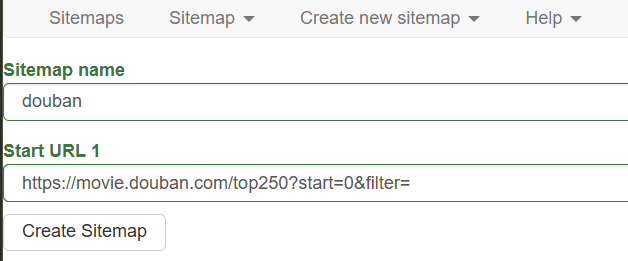
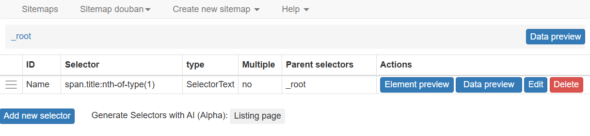
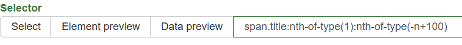
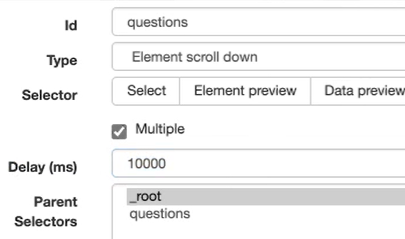
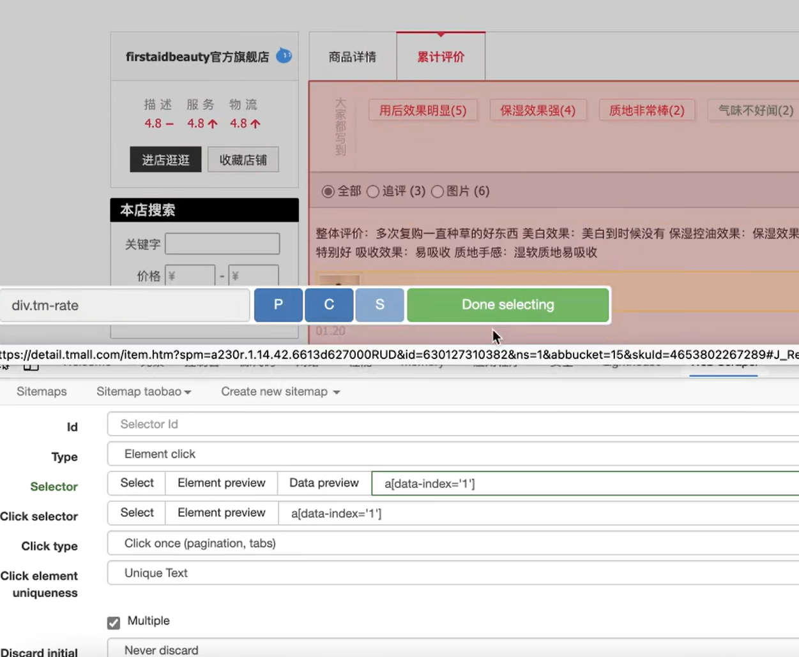
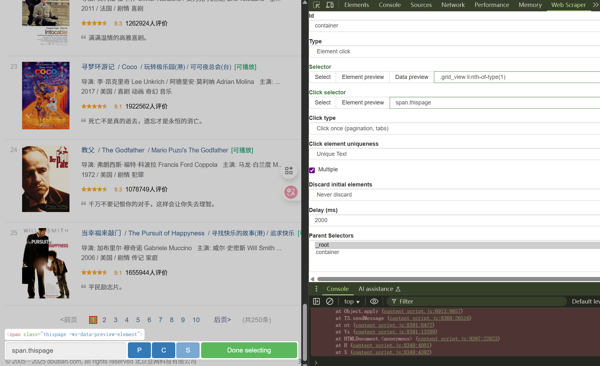
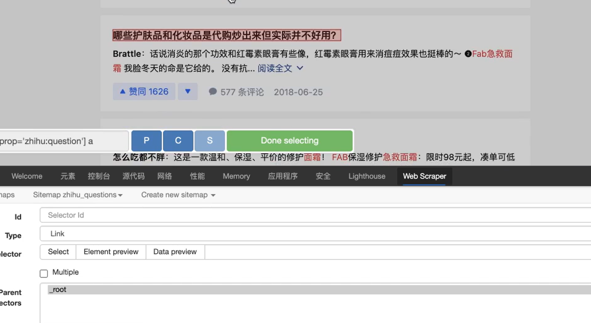
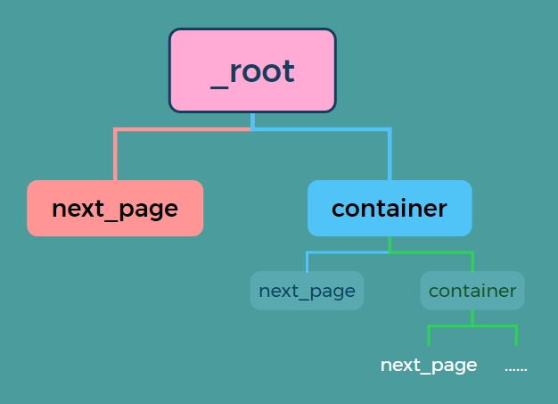
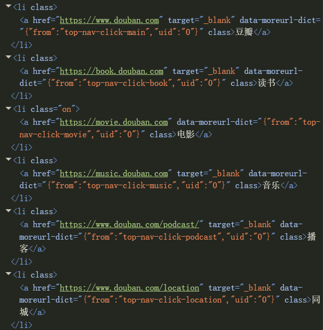
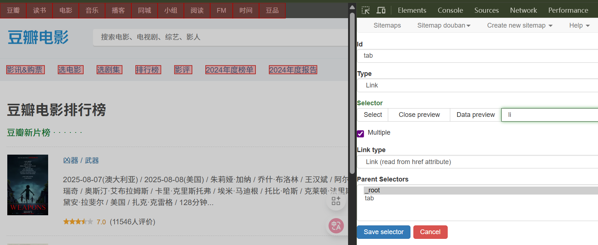

# 🕷️ Web Scraper 教程操作指南

本教程将带你从零开始学习如何使用浏览器开发者工具 + **Web Scraper 插件** 编写简单的爬虫。  
我们将以爬取 **豆瓣电影 Top 250** 为例，目标链接：[豆瓣电影 Top 250](https://movie.douban.com/top250?start=0&filter=)

---

## 1️⃣ 打开开发者工具

在浏览器中按下快捷键：

- **Windows / 部分笔记本**：`Fn + F12`  
- **Windows / 桌面键盘**：`F12`  
- **Mac (Chrome / Edge / Firefox)**：`⌘ + Option + I`

👉 或者：右键网页 → **检查 (Inspect)**  

在开发者工具的菜单中可以看到 **Web Scraper** 选项，点击进入。  


---

## 2️⃣ 创建一个 Sitemap

在 Web Scraper 页面下，点击 **Create new sitemap**，会出现三个选项，选择 **Create Sitemap**。  


接下来，填入你想要建立的爬取任务名称（例如 `douban`）和目标链接，然后点击 **Create Sitemap**。  



点击左侧的 **Sitemaps**，找到你刚刚创建的 sitemap，点击进入管理页面：  
在 **Sitemap douban** 页面中，点击 **Edit metadata**，即可修改上述内容。  


---

## 3️⃣ 创建一个 Selector

完成 Sitemap 创建后，系统会跳转到新页面。点击 **Add new selector** 开始配置要爬取的元素：  

1. 在 **Id** 栏输入一个名字，例如 `Name`（用于电影名称）。  
2. **Type** 保持默认即可。  
3. 点击 **Selector → Select**，此时网页元素会高亮。  
4. 选中两个同类型的元素（如电影名），系统会自动识别其他同类元素。  
5. 点击 **Done selecting**，右侧 **Data preview** 出现字符即为成功。  
6. 在 **Multiple Type** 中选择表格输出形式，点击 **Data preview** 可预览效果。  
7. 点击 **Save selector** 保存。  


在 **Sitemap douban** 页面中，点击 **Selectors** 可查看你创建的所有 selector。  
点击 **Edit** 可以随时修改。  



---

## 4️⃣ 简单爬取

在 **Sitemap douban** 页面中，点击 **Scrape** 开始运行任务。  

- 默认参数（`2000`）保持不变  
- 点击 **Start Scraping**  


系统会自动爬取，完成后点击 **Refresh** 即可看到结果。  

  
  
  

> 注：以上为三种 selector 的 `multiple type` 输出效果。  

最后，在 **Sitemap douban** 页面中点击 **Export data**，即可导出数据。  

---

## 5️⃣ 多个网页的信息--进阶请往后看

豆瓣链接格式说明：  

- `https://movie.douban.com/top250?start=0&filter=`  
  - 从第 1 部电影开始，展示 1–25  
- `https://movie.douban.com/top250?start=25&filter=`  
  - 从第 26 部电影开始，展示 26–50  

如果网页链接类似： `http://example.com/page/1`  `http://example.com/page/2`  
则可以写成： `http://example.com/page/[1-3]`  

对于豆瓣链接，可以改写为： ` https://movie.douban.com/top250?start=[0-225:25]&filter=`

这样 Web Scraper 就会抓取 **Top 250 的所有页面**。  


---

## 6️⃣ 导入与导出 Sitemap

- **导出 Sitemap**  
  在 **Sitemap douban** 页面点击 **Export Sitemap**，复制全部内容后即可分享。  

- **导入 Sitemap**  
  点击 **Create new sitemap** → **Import Sitemap**，粘贴内容后即可创建。  


---

## 7️⃣ 控制抓取数量--进阶看特例

在一些网站（如 [Quotes to Scrape](https://quotes.toscrape.com/scroll)）中，页面会采用无限滚动的方式加载更多数据。  
如果不加限制，插件会一直抓取，直到页面加载完成或网络断开。  
  
- 在选择器后加上 `:nth-of-type(-n+100)`，表示只抓取前 **100 条** 数据。  
- 如果想抓取前 **200 条**，则写为 `:nth-of-type(-n+200)`，以此类推。  



> 注：该方法只对点击更多型网页或者加载更多型网页有效，如果是翻页型网页，翻页之后n会重新开始计数，这时只能采取断网操作来停止爬取。

---

## 8️⃣ 设置爬取时间间隔

有时单条数据内容较长（例如某些长回复），默认的 **1s 间隔** 可能不足以完整抓取。  
此时可以将时间间隔适当调大，让爬虫在读取每条信息时有更多缓冲时间。  



---

## 9️⃣ Selector 类型与应用场景

爬虫的本质与我们手动读取信息类似：  
- 有些需要不断向下滚动才能出现新内容；  
- 有些需要点击跳转到新页面；  
- 有些是分页加载或“加载更多”；  
- 还有的以表格形式存储数据。  

Web Scraper 插件提供了多种 Selector 类型，使用方法类似，只是组合方式不同。  


### 常见 Selector 类型

1. **Element Selector**  
   - 用于多个网页的多条信息爬取。  

2. **Link Selector**  
   - 用于跳转超链接，抓取文本和链接地址。  

3. **Table Selector**  
   - 用于获取表格数据。  

4. **Element Scroll**  
   - 用于滚动加载页面。  

5. **Element Click**  
   - 用于点击操作，例如分页器、加载更多。  
   - 注意：Click 用来处理分页器，必须是点击后**不刷新**的网页；如果网页会刷新，请看“特例”部分。  
     > 注：当一个 URL 链接是 `#` 字符后数据变化时，网页不会刷新；当链接其他部分变化时，网页会刷新。  

6. **Element Attribute**  
   - 用于爬取元素属性。  
   - 例如：``  
     可以直接在 **Attribute name** 中输入 `src`、`alt` 或 `width` 来抓取属性值。  

---

## 🔹 示例：Element Selector 多字段爬取

如果我们想要同时爬取一部电影的 **排名、名称、评价** 等多条信息，可以使用 **Element Selector** 作为容器，然后在其下创建多个子 Selector 来获取不同类型的数据。  

### 步骤 1：创建 Element Selector  
新建一个 Selector，并将 **Type** 设置为 `Element`。  


### 步骤 2：在 Element 下创建子 Selector  
进入该 Element，在此页面下新建多个子 Selector，例如：  
- `rank`：排名  
- `name`：电影名称  
- `remark`：电影评价  

此时可以看到，所有子 Selector 的父选择器均为 `douban`。  


### 步骤 3：运行爬取任务  
重新执行 **Scrape**，稍等片刻，即可获得完整的结果。  


---

### 📄 示例 Sitemap

```json
{
  "_id": "douban",
  "startUrl": ["https://movie.douban.com/top250?start=[0-225:25]&filter="],
  "selectors": [
    {
      "id": "douban",
      "type": "SelectorElement",
      "parentSelectors": ["_root"],
      "selector": ".grid_view li",
      "multiple": true,
      "elementLimit": 0,
      "scroll": false
    },
    {
      "id": "name",
      "type": "SelectorText",
      "parentSelectors": ["douban"],
      "selector": "span.title:nth-of-type(1)",
      "multiple": false,
      "regex": "",
      "multipleType": "singleColumn"
    },
    {
      "id": "rank",
      "type": "SelectorText",
      "parentSelectors": ["douban"],
      "selector": "em",
      "multiple": false,
      "regex": "",
      "multipleType": "singleColumn"
    },
    {
      "id": "remark",
      "type": "SelectorText",
      "parentSelectors": ["douban"],
      "selector": ".quote span",
      "multiple": false,
      "regex": "",
      "multipleType": "singleColumn"
    }
  ]
}

```
---

## 🔹 示例：Click / Link Selector

Web Scraper 提供了 **Click Selector** 和 **Link Selector**，可以处理分页、加载更多和跳转等操作。

- **Click Selector**：用于模拟点击“加载更多”或分页按钮。  
- **Link Selector**：用于获取文本和超链接。  

  
  
  


---

## 🔹 特例：刷新的分页界面

通过 **Link Selector + Element Selector** 配合爬取：

### 操作步骤

1. **创建翻页选择器**  
   - 使用 **Link Selector** 选择“下一页”按钮，命名为 `next_page`。  

2. **设置父节点**  
   - 在 `next_page` 的 **Parent Selectors** 中，同时选择 `_root` 和 `next_page`。  
   - 方法：按住 `Shift` 键，多选父节点。  

3. **创建数据容器**  
   - 在 `next_page` 的同级下创建一个 **Element Selector**，命名为 `container`，用于抓取电影数据。  

### 注意事项

- 翻页选择器 `next_page` 和数据选择器 `container` 是 **同一级**。  
- 它们的父节点都是 `_root` 和 `next_page`。  
- 这种递归结构可以保证爬虫不断翻页并采集数据。  



---

## 🔹 特例：CSS 选择器

Web Scraper 的 Selector 底层依赖 **CSS 选择器**，可以更灵活地定位页面元素。  

### 1. 标签选择器
- 格式：`标签名`  
- 例如：`li` 会选中所有 `<li>` 标签。  
- 豆瓣、读书等网站列表通常由 `<li>` 标签构成。  

  
  

---

### 2. class 选择器
- 格式：`.classname` 或 `li.classname`  
- 作用：选中所有带有 `class="classname"` 的标签。  

---

### 3. id 选择器
- 格式：`#idname`  
- 作用：选中所有带有 `id="idname"` 的标签。  

---

### 4. 属性选择器
- 格式：`x[attribute]` 或 `x[attribute=value]`  
- 例如：`img[src]` 可以选中所有带 `src` 属性的 `` 标签。  

---

### 5. 后代元素选择器
- 格式：`父元素 子元素`  
- 示例：  
  - `div.family li`  
  - `div.family div span`  
  - `div.family span#idname`  
- 注意：**中间的空格不能省略**。  

---

### 6. 指定子元素位置
- 使用 `:nth-of-type(n)` 精确选中某个位置的元素。  
- 示例：  
  - `li:nth-of-type(2)` 表示选择第 2 个 `<li>` 标签。
 
---    
