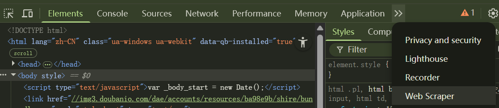
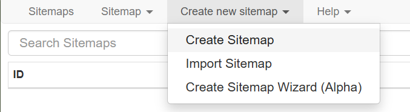
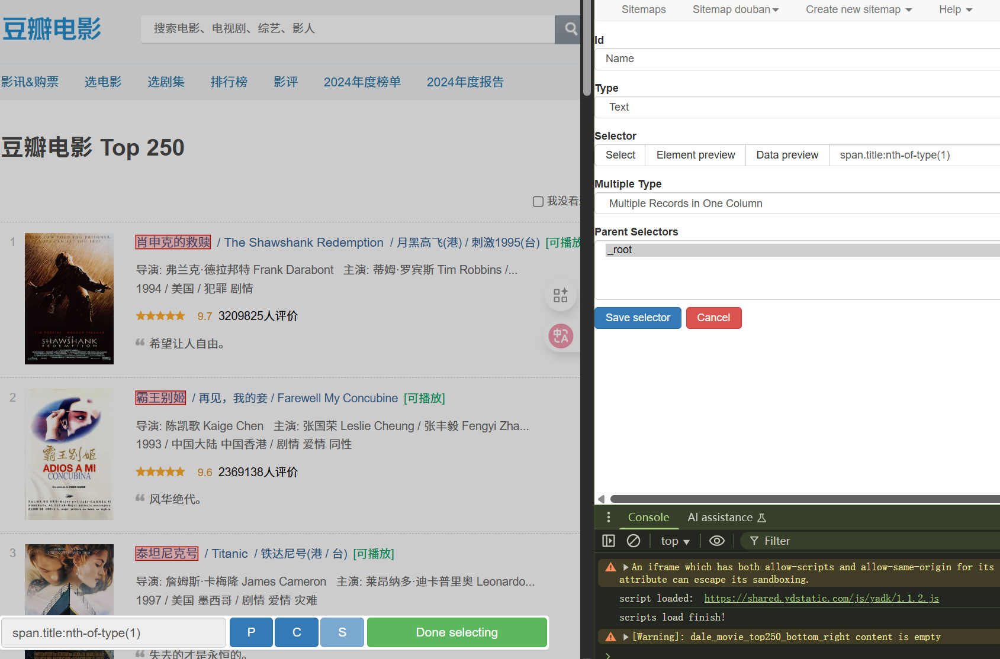
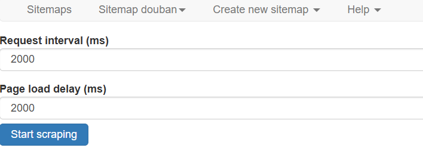

# 🕷️ Web Scraper 教程操作指南

本教程将带你从零开始学习如何使用浏览器开发者工具 + **Web Scraper 插件** 编写简单的爬虫。  
我们将以爬取 **豆瓣电影 Top 250** 为例，目标链接：[豆瓣电影 Top 250](https://movie.douban.com/top250?start=0&filter=)

---

## 1️⃣ 打开开发者工具

在浏览器中按下快捷键：

- **Windows / 部分笔记本**：`Fn + F12`  
- **Windows / 桌面键盘**：`F12`  
- **Mac (Chrome / Edge / Firefox)**：`⌘ + Option + I`

👉 或者：右键网页 → **检查 (Inspect)**  

在开发者工具的菜单中可以看到 **Web Scraper** 选项，点击进入。  

---

## 2️⃣ 创建一个 Sitemap

在 Web Scraper 页面下，点击 **Create new sitemap**，会出现三个选项，选择 **Create Sitemap**。  

接下来，填入你想要建立的爬取任务名称（例如 `douban`）和目标链接，然后点击 **Create Sitemap**。  

点击左侧的 **Sitemaps**，找到你刚刚创建的 sitemap，点击进入管理页面：  
在 **Sitemap douban** 页面中，点击 **Edit metadata**，即可修改上述内容。  

---

## 3️⃣ 创建一个 Selector

完成 Sitemap 创建后，系统会跳转到新页面。点击 **Add new selector** 开始配置要爬取的元素：  

1. 在 **Id** 栏输入一个名字，例如 `Name`（用于电影名称）。  
2. **Type** 保持默认即可。  
3. 点击 **Selector → Select**，此时网页元素会高亮。  
4. 选中两个同类型的元素（如电影名），系统会自动识别其他同类元素。  
5. 点击 **Done selecting**，右侧 **Data preview** 出现字符即为成功。  
6. 在 **Multiple Type** 中选择表格输出形式，点击 **Data preview** 可预览效果。  
7. 点击 **Save selector** 保存。  

在 **Sitemap douban** 页面中，点击 **Selectors** 可查看你创建的所有 selector。  
点击 **Edit** 可以随时修改。  

---

## 4️⃣ 简单爬取

在 **Sitemap douban** 页面中，点击 **Scrape** 开始运行任务。  

- 默认参数（`2000`）保持不变  
- 点击 **Start Scraping**  

系统会自动爬取，完成后点击 **Refresh** 即可看到结果。  

  
  
  

> 注：以上为三种 selector 的 `multiple type` 输出效果。  

最后，在 **Sitemap douban** 页面中点击 **Export data**，即可导出数据。  

---

## 5️⃣ 爬取多个网页的信息

豆瓣链接格式说明：  

- `https://movie.douban.com/top250?start=0&filter=`  
  - 从第 1 部电影开始，展示 1–25  
- `https://movie.douban.com/top250?start=25&filter=`  
  - 从第 26 部电影开始，展示 26–50  

如果网页链接类似： `http://example.com/page/1`  `http://example.com/page/2`  
则可以写成： `http://example.com/page/[1-3]`  

对于豆瓣链接，可以改写为： ` https://movie.douban.com/top250?start=[0-225:25]&filter=`

这样 Web Scraper 就会抓取 **Top 250 的所有页面**。  

---

## 6️⃣ 导入与导出 Sitemap

- **导出 Sitemap**  
  在 **Sitemap douban** 页面点击 **Export Sitemap**，复制全部内容后即可分享。  

- **导入 Sitemap**  
  点击 **Create new sitemap** → **Import Sitemap**，粘贴内容后即可创建。  

---

## 7️⃣ 爬取多个网页的多条信息

除了电影名称，你也可以在同一个 Sitemap 中添加多个 Selector，例如：  
- 电影名称  
- 评分  
- 简介  

配置多个 Selector 后，Web Scraper 会自动爬取并输出对应的数据列，方便进一步分析。  

