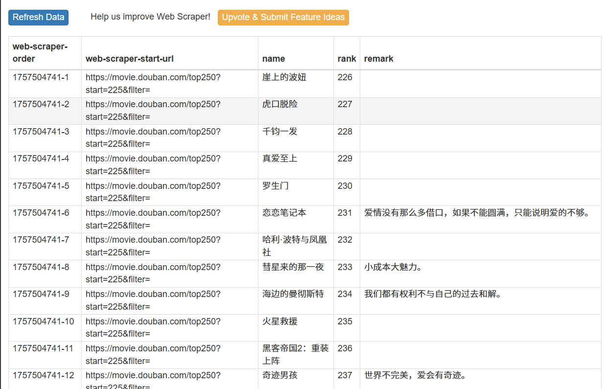

# 🕷️ Web Scraper 教程操作指南

本教程将带你从零开始学习如何使用浏览器开发者工具 + **Web Scraper 插件** 编写简单的爬虫。  
我们将以爬取 **豆瓣电影 Top 250** 为例，目标链接：[豆瓣电影 Top 250](https://movie.douban.com/top250?start=0&filter=)

---

## 1️⃣ 打开开发者工具

在浏览器中按下快捷键：

- **Windows / 部分笔记本**：`Fn + F12`  
- **Windows / 桌面键盘**：`F12`  
- **Mac (Chrome / Edge / Firefox)**：`⌘ + Option + I`

👉 或者：右键网页 → **检查 (Inspect)**  

在开发者工具的菜单中可以看到 **Web Scraper** 选项，点击进入。  


---

## 2️⃣ 创建一个 Sitemap

在 Web Scraper 页面下，点击 **Create new sitemap**，会出现三个选项，选择 **Create Sitemap**。  


接下来，填入你想要建立的爬取任务名称（例如 `douban`）和目标链接，然后点击 **Create Sitemap**。  


点击左侧的 **Sitemaps**，找到你刚刚创建的 sitemap，点击进入管理页面：  
在 **Sitemap douban** 页面中，点击 **Edit metadata**，即可修改上述内容。  


---

## 3️⃣ 创建一个 Selector

完成 Sitemap 创建后，系统会跳转到新页面。点击 **Add new selector** 开始配置要爬取的元素：  

1. 在 **Id** 栏输入一个名字，例如 `Name`（用于电影名称）。  
2. **Type** 保持默认即可。  
3. 点击 **Selector → Select**，此时网页元素会高亮。  
4. 选中两个同类型的元素（如电影名），系统会自动识别其他同类元素。  
5. 点击 **Done selecting**，右侧 **Data preview** 出现字符即为成功。  
6. 在 **Multiple Type** 中选择表格输出形式，点击 **Data preview** 可预览效果。  
7. 点击 **Save selector** 保存。  


在 **Sitemap douban** 页面中，点击 **Selectors** 可查看你创建的所有 selector。  
点击 **Edit** 可以随时修改。  


---

## 4️⃣ 简单爬取

在 **Sitemap douban** 页面中，点击 **Scrape** 开始运行任务。  

- 默认参数（`2000`）保持不变  
- 点击 **Start Scraping**  


系统会自动爬取，完成后点击 **Refresh** 即可看到结果。  

  
  
  

> 注：以上为三种 selector 的 `multiple type` 输出效果。  

最后，在 **Sitemap douban** 页面中点击 **Export data**，即可导出数据。  

---

## 5️⃣ 多个网页的信息--进阶请看13

豆瓣链接格式说明：  

- `https://movie.douban.com/top250?start=0&filter=`  
  - 从第 1 部电影开始，展示 1–25  
- `https://movie.douban.com/top250?start=25&filter=`  
  - 从第 26 部电影开始，展示 26–50  

如果网页链接类似： `http://example.com/page/1`  `http://example.com/page/2`  
则可以写成： `http://example.com/page/[1-3]`  

对于豆瓣链接，可以改写为： ` https://movie.douban.com/top250?start=[0-225:25]&filter=`

这样 Web Scraper 就会抓取 **Top 250 的所有页面**。  


---

## 6️⃣ 导入与导出 Sitemap

- **导出 Sitemap**  
  在 **Sitemap douban** 页面点击 **Export Sitemap**，复制全部内容后即可分享。  

  

- **导入 Sitemap**  
  点击 **Create new sitemap** → **Import Sitemap**，粘贴内容后即可创建。  

  

---

## 7️⃣ 多个网页的多条信息

如果我们想要同时爬取一个电影的 **排名、名称、评价** 等多条信息，可以使用 **Element Selector** 作为容器，然后在其下创建多个子 Selector 来获取不同类型的数据。  

### 步骤 1：创建 Element Selector  
首先，创建一个新的 Selector，并将 **Type** 设置为 `Element`。  


### 步骤 2：在 Element 下创建子 Selector  
进入该 Element，在此页面下新建多个子 Selector，例如：  
- `rank`：排名  
- `name`：电影名称  
- `remark`：电影评价  

此时可以看到，所有子 Selector 的父选择器均为 `douban`。  


### 步骤 3：运行爬取任务  
重新执行 **Scrape**，稍等片刻，即可获得完整的结果。  



---

## 📄 示例 Sitemap 配置

以下是一个示例 Sitemap，你可以直接复制后导入 Web Scraper 使用：  

```json
{
  "_id": "douban",
  "startUrl": ["https://movie.douban.com/top250?start=[0-225:25]&filter="],
  "selectors": [
    {
      "id": "douban",
      "type": "SelectorElement",
      "parentSelectors": ["_root"],
      "selector": ".grid_view li",
      "multiple": true,
      "elementLimit": 0,
      "scroll": false
    },
    {
      "id": "name",
      "type": "SelectorText",
      "parentSelectors": ["douban"],
      "selector": "span.title:nth-of-type(1)",
      "multiple": false,
      "regex": "",
      "multipleType": "singleColumn"
    },
    {
      "id": "rank",
      "type": "SelectorText",
      "parentSelectors": ["douban"],
      "selector": "em",
      "multiple": false,
      "regex": "",
      "multipleType": "singleColumn"
    },
    {
      "id": "remark",
      "type": "SelectorText",
      "parentSelectors": ["douban"],
      "selector": ".quote span",
      "multiple": false,
      "regex": "",
      "multipleType": "singleColumn"
    }
  ]
}
````

---

## 8️⃣ 处理动态加载 - 加载更多的解决办法

有些网站不是一次性加载所有数据，而是通过点击 **“加载更多”** 按钮或滚动页面来获取新内容。
* [Quotes to Scrape - Scroll](https://quotes.toscrape.com/scroll) （无限滚动示例）
* [Books to Scrape](https://books.toscrape.com/) （分页示例）

---

## 9️⃣ 控制抓取数量

在一些网站（如 [Quotes to Scrape](https://quotes.toscrape.com/scroll)）中，页面会采用无限滚动的方式加载更多数据。
如果不加限制，插件会一直抓取，直到页面加载完成或网络断开。

我们可以通过 **CSS 伪类选择器** 限制抓取数量：

* 假设 selector 为 `dl.article-card`，会默认抓取网页中所有的 `dl.article-card` 元素。
* 在选择器后加上 `:nth-of-type(-n+100)`，表示只抓取前 **100 条** 数据。
* 如果想抓取前 **200 条**，则写为 `:nth-of-type(-n+200)`，以此类推。


---

## 🔟 滚动加载类型网页

有些页面使用 **无限滚动 (Infinite Scroll)** 技术来动态加载内容。
* [Quotes to Scrape - Scroll](https://quotes.toscrape.com/scroll)
* 新闻网站（如 BBC 或 CNN 的部分栏目页）

---

## 1️⃣1️⃣ 内容为超链接

如果我们不仅要获取文本，还要抓取其 **链接地址**：

---

## 1️⃣2️⃣ 表格数据

很多网站的数据会以 **表格 (table)** 的形式呈现，例如 Wikipedia 的统计表。
* [Wikipedia - List of countries by GDP](https://en.wikipedia.org/wiki/List_of_countries_by_GDP_%28nominal%29)

```

13 
