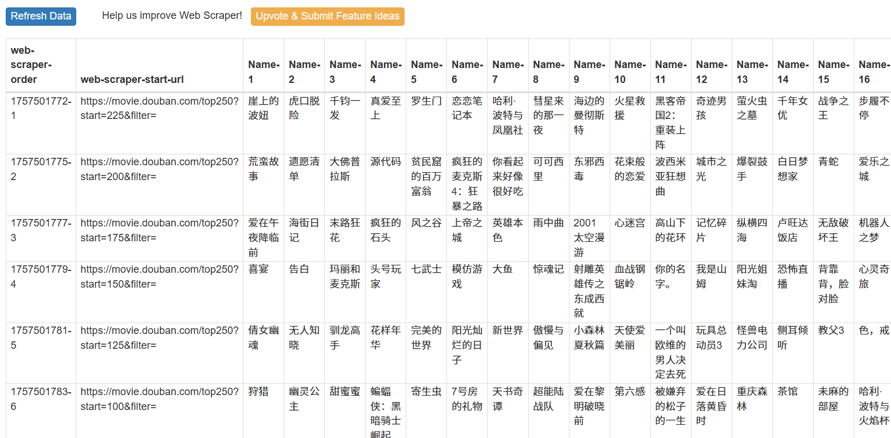
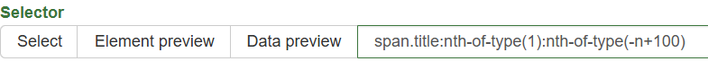
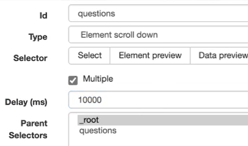

# 进阶篇

## 1️⃣ 多页面的抓取（分页 / 范围 URL）

豆瓣 Top250 的分页示例：

- 第一页：`https://movie.douban.com/top250?start=0&filter=` （从第 1 部电影开始，展示 1–25）  
- 第二页：`https://movie.douban.com/top250?start=25&filter=` （从第 26 部电影开始，展示 26–50）

如果页面 URL 可按数字递增，可使用范围写法.
如网页链接类似： `http://example.com/page/1`  `http://example.com/page/2`  
则可以写成： `http://example.com/page/[1-3]`

对于豆瓣 Top250，可以改写为： ` https://movie.douban.com/top250?start=[0-225:25]&filter=`

这样 Web Scraper 将遍历所有页（0,25,50,...,225）并抓取每页内容。

---

## 2️⃣ 控制抓取数量（限制条目）

在一些网站（如 [Quotes to Scrape](https://quotes.toscrape.com/scroll)）中，页面会采用无限滚动的方式不断加载更多数据，若不加限制可能会一直抓取，直到页面加载完成或网络断开。

可在选择器后使用 `:nth-of-type` 限制输出：

- 如 `selector:nth-of-type(-n+100)` → 只抓前 **100** 条。  
- 改为 `-n+200` 则抓前 **200** 条。

> 注：该方法对“点击加载更多/无限滚动”有效；对于翻页型网页，翻页后 `n` 会重新计数。

---

## 3️⃣ 设置爬取时间间隔（避免丢失长内容）

- 默认间隔（例如 1s）在抓取长文本时可能不够。  
- 将抓取间隔调整为 2–5s 可提高稳定性（视目标页面和网络情况而定）。

