# 基础篇

## 1️⃣ 打开开发者工具

在浏览器中按下快捷键：

- **Windows / 部分笔记本**：`Fn + F12`  
- **Windows / 桌面键盘**：`F12`  
- **Mac (Chrome / Edge / Firefox)**：`⌘ + Option + I`

或者：右键网页 → **检查 (Inspect)**。  
在开发者工具的菜单中可以看到 **Web Scraper** 选项，点击进入。  

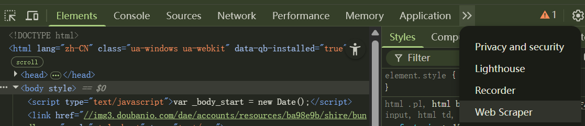

---

## 2️⃣ 创建 Sitemap

- 在 Web Scraper 页面下，点击 **Create new sitemap** → 选择 **Create Sitemap**。  

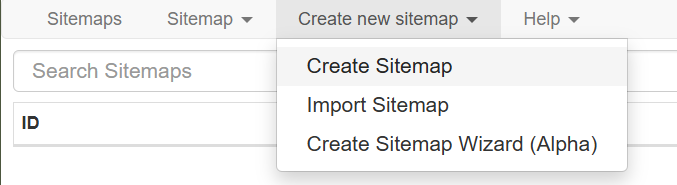

- 填入任务名称（例如 `douban`）和目标链接，点击 **Create Sitemap**。  

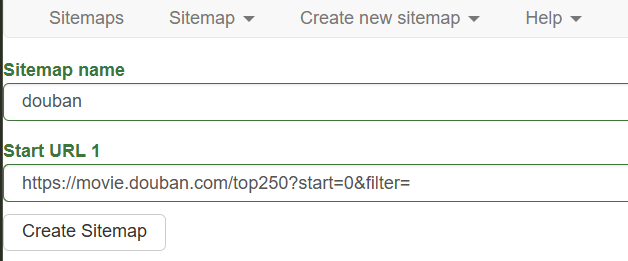

- 在左侧的 **Sitemaps** 中找到并进入刚创建的 sitemap，点击 **Edit metadata** 可修改任务信息。  

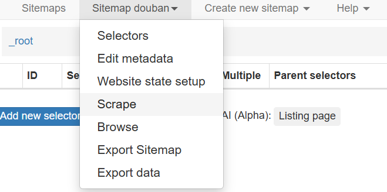

---

## 3️⃣ 创建 Selector（选择要抓取的元素）

1. 在 Sitemap 页面点击 **Add new selector**。  
2. 在 **Id** 中填入名字（例如 `Name`），**Type** 保持默认（视需要修改）。  
3. 点击 **Selector → Select**，在页面上选中示例元素（通常选两个同类元素以便插件识别所有同类项）。  
4. 点击 **Done selecting**，在右侧 **Data preview** 检查采集文本是否正确。  
5. 在 **Multiple Type** 中选择输出形式（例如表格形式），然后 **Save selector**。

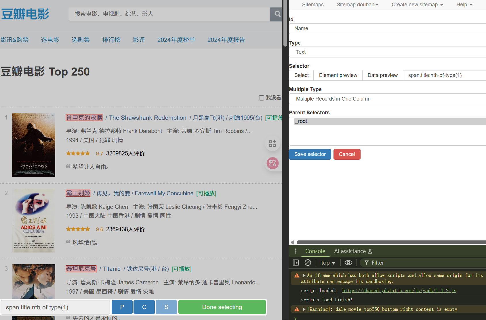
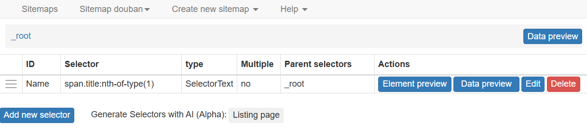

---

## 4️⃣ 运行一次简单爬取

- 在 Sitemap 页面点击 **Scrape**。  
- 默认参数（如 `2000`）通常可保持不变，点击 **Start Scraping** 开始。  

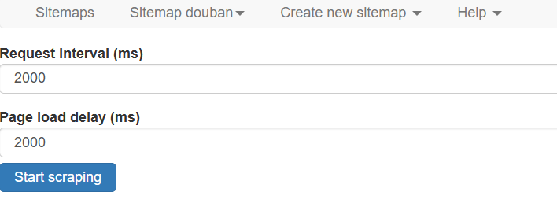

- 爬取完成后点击 **Refresh** 查看结果并 **Export data** 导出 CSV/JSON。  
  下面为三种 `multiple type` 的输出示例：

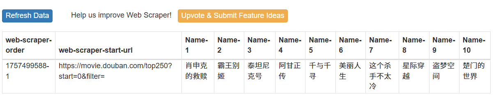  
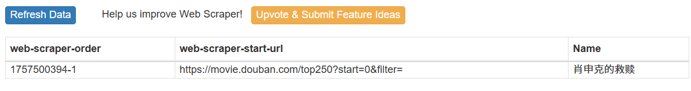  
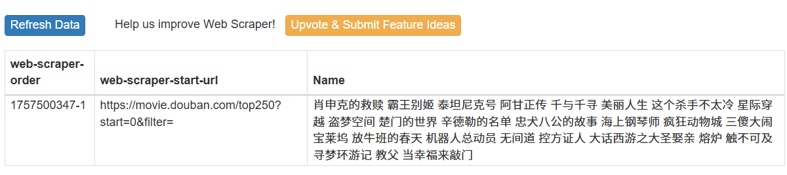

---

## 5️⃣ 导入与导出 Sitemap

- **导出 Sitemap**：在 Sitemap 页面点击 **Export Sitemap**，复制 JSON 分享或备份。  
- **导入 Sitemap**：点击 **Create new sitemap** → **Import Sitemap**，粘贴 JSON 并创建相同任务。  

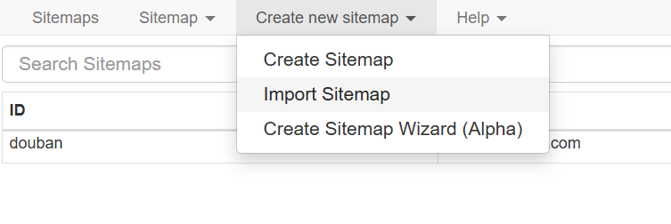

