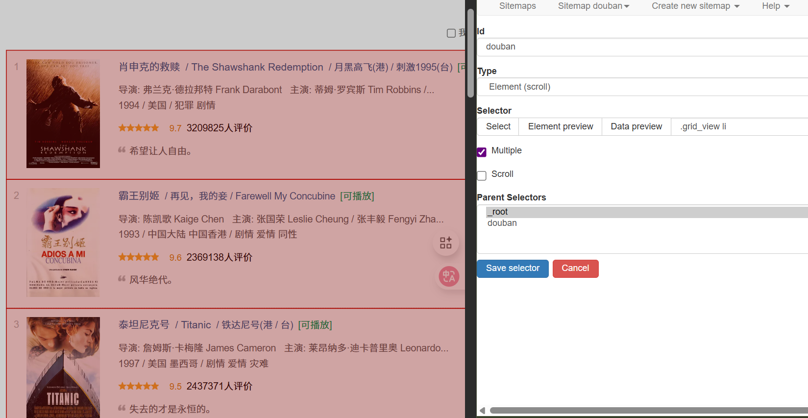
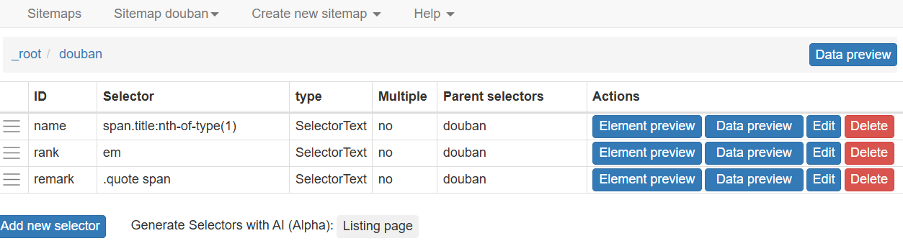
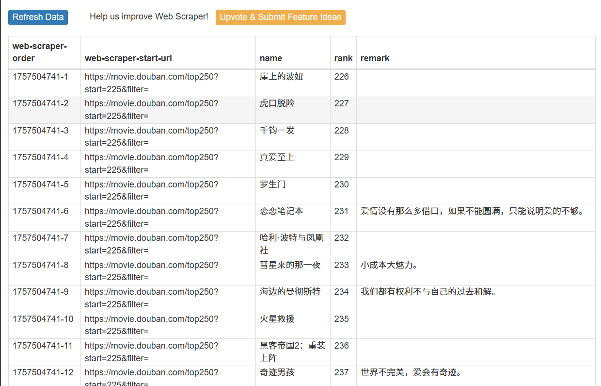
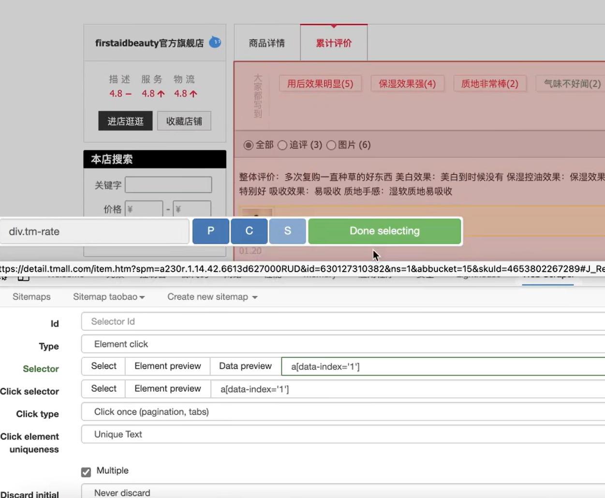
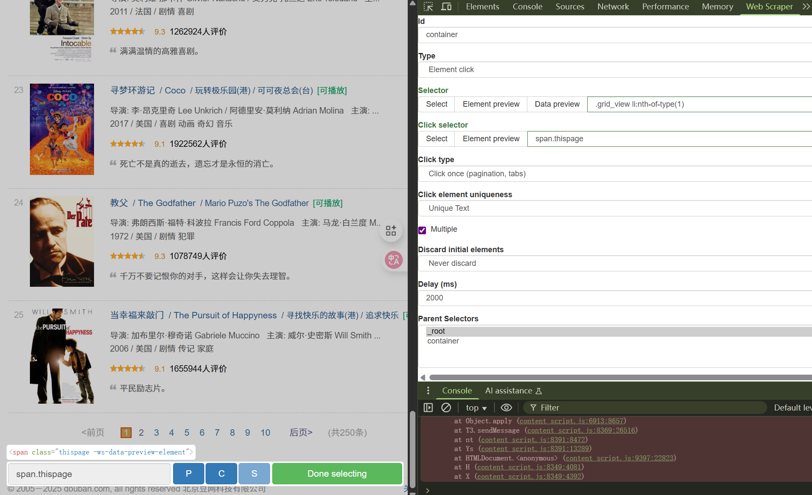
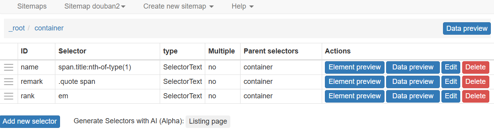
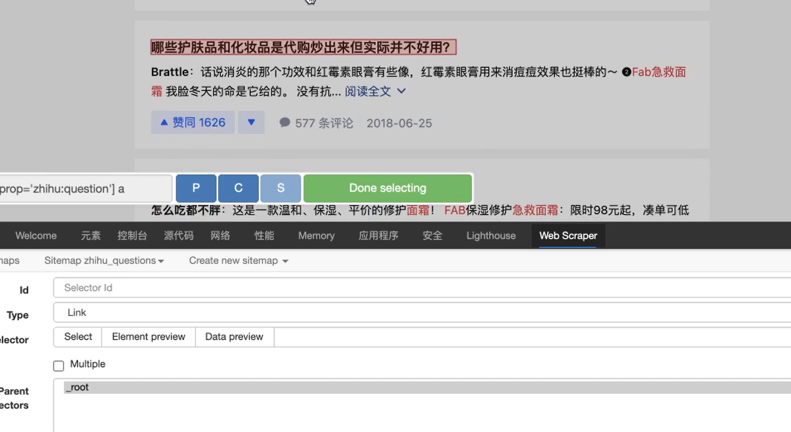
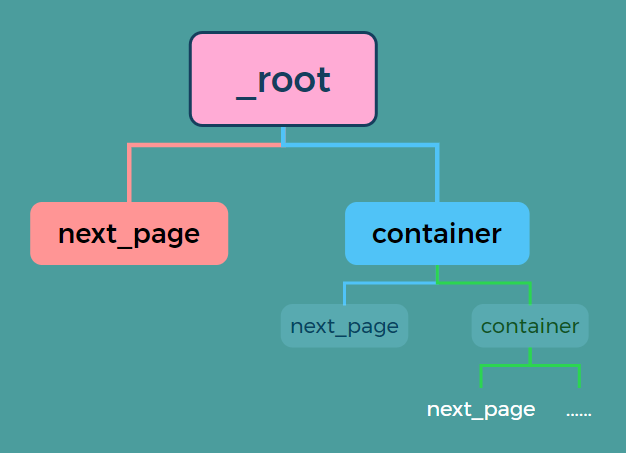
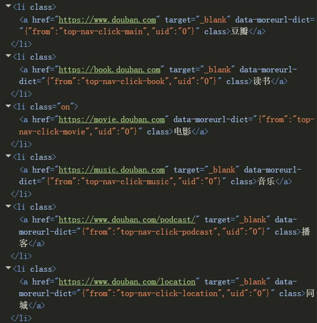
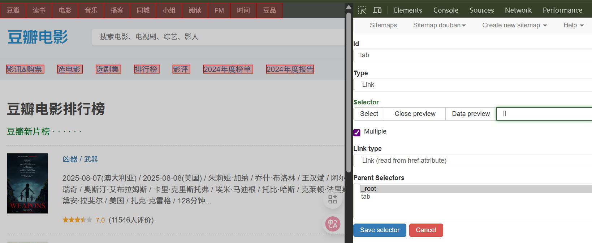

## 🔹 示例：Element Selector 多字段爬取

如果我们想要同时爬取一部电影的 **排名、名称、评价** 等多条信息，可以使用 **Element Selector** 作为容器，然后在其下创建多个子 Selector 来获取不同类型的数据。  

### 步骤 1：创建 Element Selector  
新建一个 Selector，并将 **Type** 设置为 `Element`。  



### 步骤 2：在 Element 下创建子 Selector  
进入该 Element，在此页面下新建多个子 Selector，例如：  
- `rank`：排名  
- `name`：电影名称  
- `remark`：电影评价  

此时可以看到，所有子 Selector 的父选择器均为 `douban`。  



### 步骤 3：运行爬取任务  
重新执行 **Scrape**，稍等片刻，即可获得完整的结果。  



---

### 📄 示例 Sitemap

```json
{
  "_id": "douban",
  "startUrl": ["https://movie.douban.com/top250?start=[0-225:25]&filter="],
  "selectors": [
    {
      "id": "douban",
      "type": "SelectorElement",
      "parentSelectors": ["_root"],
      "selector": ".grid_view li",
      "multiple": true,
      "elementLimit": 0,
      "scroll": false
    },
    {
      "id": "name",
      "type": "SelectorText",
      "parentSelectors": ["douban"],
      "selector": "span.title:nth-of-type(1)",
      "multiple": false,
      "regex": "",
      "multipleType": "singleColumn"
    },
    {
      "id": "rank",
      "type": "SelectorText",
      "parentSelectors": ["douban"],
      "selector": "em",
      "multiple": false,
      "regex": "",
      "multipleType": "singleColumn"
    },
    {
      "id": "remark",
      "type": "SelectorText",
      "parentSelectors": ["douban"],
      "selector": ".quote span",
      "multiple": false,
      "regex": "",
      "multipleType": "singleColumn"
    }
  ]
}

```
---

## 🔹 示例：Click / Link Selector

Web Scraper 提供了 **Click Selector** 和 **Link Selector**，可以处理分页、加载更多和跳转等操作。

- **Click Selector**：用于模拟点击“加载更多”或分页按钮。  
- **Link Selector**：用于获取文本和超链接。  

  
  
  


---

## 🔹 特例：刷新的分页界面

通过 **Link Selector + Element Selector** 配合爬取：

### 操作步骤

1. **创建翻页选择器**  
   - 使用 **Link Selector** 选择“下一页”按钮，命名为 `next_page`。  

2. **设置父节点**  
   - 在 `next_page` 的 **Parent Selectors** 中，同时选择 `_root` 和 `next_page`。  
   - 方法：按住 `Shift` 键，多选父节点。  

3. **创建数据容器**  
   - 在 `next_page` 的同级下创建一个 **Element Selector**，命名为 `container`，用于抓取电影数据。  

### 注意事项

- 翻页选择器 `next_page` 和数据选择器 `container` 是 **同一级**。  
- 它们的父节点都是 `_root` 和 `next_page`。    
- 这种递归结构可以保证爬虫不断翻页并采集数据。  



---

## 🔹 特例：CSS 选择器

Web Scraper 的 Selector 底层依赖 **CSS 选择器**，可以更灵活地定位页面元素。  

### 1. 标签选择器
- 格式：`标签名`  
- 例如：`li` 会选中所有 `<li>` 标签。  
- 豆瓣、读书等网站列表通常由 `<li>` 标签构成。  

  
  

---

### 2. class 选择器
- 格式：`.classname` 或 `li.classname`  
- 作用：选中所有带有 `class="classname"` 的标签。  

---

### 3. id 选择器
- 格式：`#idname`  
- 作用：选中所有带有 `id="idname"` 的标签。  

---

### 4. 属性选择器
- 格式：`x[attribute]` 或 `x[attribute=value]`  
- 例如：`img[src]` 可以选中所有带 `src` 属性的 `` 标签。  

---

### 5. 后代元素选择器
- 格式：`父元素 子元素`  
- 示例：  
  - `div.family li`  
  - `div.family div span`  
  - `div.family span#idname`  
- 注意：**中间的空格不能省略**。  

---

### 6. 指定子元素位置
- 使用 `:nth-of-type(n)` 精确选中某个位置的元素。  
- 示例：  
  - `li:nth-of-type(2)` 表示选择第 2 个 `<li>` 标签。
