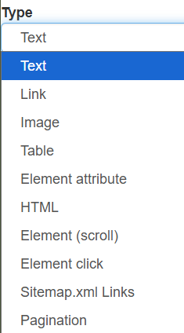

# Selector 

## Selector 类型与应用场景

爬虫的本质与我们手动读取信息类似：  
- 有些需要不断向下滚动才能出现新内容；  
- 有些需要点击跳转到新页面；  
- 有些是分页加载或“加载更多”；  
- 还有的以表格形式存储数据。

Web Scraper 提供多种 Selector 来应对不同场景：

---

## 常见 Selector

1. **Element**  
   - 用于多个网页的多条信息爬取。  

2. **Link**  
   - 用于跳转超链接，抓取文本和链接地址。  

3. **Table**  
   - 用于获取表格数据。  

4. **Scroll**  
   - 用于滚动加载页面。  

5. **Click**  
   - 用于点击操作，例如分页器、加载更多。  
   - 注意：Click 用来处理分页器，必须是点击后**不刷新**的网页；如果网页会刷新，请看“特例”部分。  
     > 注：当一个 URL 链接是 `#` 字符后数据变化时，网页不会刷新；当链接其他部分变化时，网页会刷新。  
6. **Attribute**  
   - 用于爬取元素属性。  
   - 例如：``  
     可以直接在 **Attribute name** 中输入 `src`、`alt` 或 `width` 来抓取属性值。

7. **Regex**  
   - 有些情况下，我们只需要文本中的一部分内容，例如从 **“11546人评价”** 中只提取数字 `11546`，这时可以在 Selector 中结合 **正则表达式** 使用。
   - 常用正则表达式 & 重复匹配的正则表达式： [regex](regex.md)  
